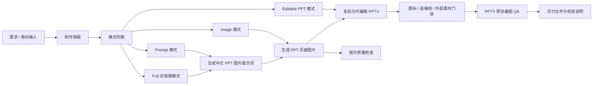

# iML-PPTX

iML-PPTX 是支持制作美观且支持编辑中文商务 PPT的SKILL技能 。它不是单纯的“写提示词”或“生成 PPT 文件”，而是把需求简报、PPT 图片提示词、页面图片生成、外部视觉取材、可编辑 PPTX 复刻、图标与连接线治理、预览质检串成一条完整工作流。

它适合这些任务：

- 生成中文 16:9 PPT 页面图片提示词
- 根据提示词生成正式培训课件风格的 PPT 页面图片
- 把图片、PDF、截图复刻成可编辑 PowerPoint
- 从主题、资料、产品网站或截图出发，完整生产一套可交付 PPTX
- 为产品培训、软件操作、AI 工具介绍、企业内训、方法论汇报制作可编辑课件

默认视觉风格是：白底、深灰正文、科技蓝强调色、中文商务培训课件、极简信息图、可投屏阅读、`PingFang SC` 字体。

## 核心理念

iML-PPTX 的核心目标是解决一个常见断点：

> AI 可以生成很好看的 PPT 页面图，但页面图不能编辑；传统 PPT 可以编辑，但从零搭建复杂版式很慢。

因此 iML-PPTX 采用“先生成/获取视觉源，再复刻为可编辑 PPTX”的方式：

1. 用提示词或真实素材得到高质量页面视觉参考
2. 把视觉参考拆解成标题、模块、卡片、表格、图标、连接线、截图和图片资产
3. 用 PowerPoint 可编辑对象重建文本、形状、表格、线条、箭头、标签和 callout
4. 对图标、logo、截图、照片等使用高质量图片资产
5. 导出预览图进行目检，修复重叠、错位、裁切和连线问题

## 运行流程



## 四种工作模式

### 1. Prompt 模式

当用户需要“PPT 图片提示词”“页面 prompt”“一组课件提示词”时使用。

每页提示词会包含：

- 页面类型
- 标题
- 核心结论
- 内容模块
- 版式要求
- 视觉系统
- 图标 / 图片策略
- 避免事项

典型输出是一组可直接复制到图片模型里的中文 prompt。

### 2. Image 模式

当用户需要“直接生成图片”“根据提示词生成 PPT 图片”时使用。

流程是：

1. 整理或生成页面 prompt
2. 逐页生成 16:9 PPT 页面图片
3. 使用稳定文件名保存，例如 `P01_标题.png`
4. 检查图片比例、中文可读性、版式层级、图标逻辑、连接线安全性
5. 必要时重写 prompt 或重新生成

### 3. Editable PPT 模式

当用户给出图片、PDF、截图，并要求“复刻”“转成可编辑 PPTX”“完全按照图片”时使用。

核心原则：

- 源图片是视觉真相，不重新设计另一套 PPT
- 文字必须尽量可编辑
- 卡片、表格、线条、箭头、标签、背景框应尽量可编辑
- 图标、logo、照片、截图可以作为高清图片资产插入
- captions、callouts、页码、标题 chrome 等仍应尽量可编辑

### 4. Full 全链路模式

当用户从主题、PDF、网页、产品说明或资料开始，希望直接得到最终 PPTX 时使用。

完整链路是：

```text
需求简报
→ 外部素材取材
→ 页面节奏规划
→ PPT 图片提示词
→ 页面图片生成
→ 可编辑 PPTX 复刻
→ 布局 / 连接线 / 预览 QA
→ 最终交付
```

## 技能组成

| 模块 | 作用 |
| --- | --- |
| `SKILL.md` | 技能入口，定义目标、模式路由、默认风格、强制门禁和交付格式 |
| `references/prompt-writing.md` | 规定 PPT 图片提示词结构，控制页面不要海报化、网页化、拥挤化 |
| `references/editable-replication.md` | 指导如何把图片、PDF、截图重建为可编辑 PPTX |
| `references/external-visuals.md` | 遇到真实产品、网站、软件、公司、人物、地点时，先取官方或可信视觉素材 |
| `references/icons-connectors.md` | 管理图标语义、图标清单、连接线类型、锚点和避让规则 |
| `references/qa.md` | 规定 PPTX 必须导出预览图并目检，修复重叠、裁切、错位和连线问题 |
| `references/workflow-recipes.md` | 常见任务配方，例如只写提示词、直接成图、图片复刻、产品培训课件 |
| `references/scripts.md` | 辅助脚本使用说明 |
| `resources/icons/` | 离线图标索引和语义包 |
| `scripts/` | 简报生成、图标选择、图标渲染、布局检查、连接线检查、预览导出等工具 |

## 关键门禁

### Visual Asset Gate

当页面涉及产品、软件、网站、公司、人物、地点、设备、真实场景时，优先获取官方或可信视觉素材。

这些素材可以作为：

- 右侧产品截图区
- 截图卡片
- 操作步骤 walkthrough
- 案例缩略图
- 场景图
- 背景弱化图

原则是：图片必须帮助理解内容，而不是填空装饰。

### Icon Gate

当一页有 3 个以上模块、卡片或步骤时，需要先做图标计划。

图标不是装饰，而是页面逻辑的一部分。常见图标叙事模式包括：

- `Hero + satellites`：中心主图标 + 周边模块
- `Step progression`：流程步骤递进
- `Contrast pair`：左右对比
- `Metric anchors`：关键指标锚点
- `Group headers`：分组标题图标
- `Sparse accent`：少量强调图标

### Connector Gate

连接线、箭头、流程线必须有明确语义。

每条线需要考虑：

- 目的：流程、归属、层级、对比、趋势还是装饰
- 是否必要
- 类型：短箭头、正交折线、关系场、轴线、括号等
- 锚点：从哪个对象边缘到哪个对象边缘
- 避让：标题、正文、图标、数字、页码
- 层级：在卡片后方、卡片与图标之间，还是上层

硬规则：连接线不能穿过正文、标题、关键数字或图标。

### Screenshot QA Gate

只要生成、修复或复刻 PPTX，就必须导出预览图并检查。

检查重点：

- 文本是否重叠或被裁切
- 卡片、标签、徽章是否压线
- 图标是否缺失或空白
- 图片裁切是否遮挡主体
- 连线是否穿过文字
- 表格是否越界
- 页面层级是否和源图一致
- 字体和页码是否正确

脚本检查不能替代视觉预览。

## 常用脚本

| 脚本 | 作用 |
| --- | --- |
| `scripts/start_brief.py` | 生成制作简报模板 |
| `scripts/icon_picker.py` | 按业务语义搜索合适图标 |
| `scripts/icon_narrative.py` | 生成页面级图标叙事方案 |
| `scripts/connector_narrative.py` | 生成连接线策略 |
| `scripts/render_lucide_icon.py` | 渲染单个 lucide 图标 |
| `scripts/render_icon_manifest.py` | 按图标清单批量渲染 SVG / PNG |
| `scripts/build_icon_resources.py` | 重建离线图标资源 |
| `scripts/ppt_replicate_helpers.py` | 可编辑 PPTX 构建辅助函数 |
| `scripts/layout_guard.py` | 检查潜在布局重叠 |
| `scripts/connector_guard.py` | 检查异常连接线和斜线 |
| `scripts/preview_pptx.sh` | 导出 PPTX 预览图用于 QA |

## 示例任务

### 生成 PPT 图片提示词

```text
帮我生成 5 页“企业AI 应用培训”的 PPT 图片提示词，白底科技蓝风格。
```

输出将包含制作简报和逐页 prompt，例如：

```text
P01｜AI 应用全景：从工具使用到流程重构
请生成一页16:9中文PPT内容页图片。
页面类型：总览页
核心结论：AI 应用不是单点工具替换，而是从知识、流程、组织和治理共同演进。
...
```

### 直接生成 PPT 页面图片

```text
按照这组提示词直接生成 3 张 PPT 图片。
```

输出为：

```text
P01_标题.png
P02_标题.png
P03_标题.png
```

并附带图片检查结果。

### 图片复刻成可编辑 PPTX

```text
把这张图片完全复刻成可编辑 PPTX，不要重新设计。
```

输出为：

```text
output/deck.pptx
preview/deck.png
```

说明中会标注：

- 哪些对象可编辑
- 哪些是图片资产
- 哪些页面已预览检查
- 是否存在已知限制

### 产品培训课件

```text
帮我做一套某产品的新员工培训 PPT，需要截图讲解核心操作流程。
```

流程会优先获取或使用官方 / 用户提供的产品截图，然后制作：

- 操作流程页
- 截图 walkthrough
- callout 标注
- 可编辑箭头、编号、标签和说明文字

## 推荐目录结构

```text
project/
├── assets/
│   ├── source/
│   └── source_manifest.json
├── prompts/
├── images/
│   ├── P01_标题.png
│   └── P02_标题.png
├── output/
│   └── deck.pptx
└── preview/
    └── deck.png
```

## 交付报告格式

生产型任务完成后，推荐使用这种交付说明：

```text
已完成。

输出文件：
- output/deck.pptx

预览检查：
- preview/deck.png，已检查全部页面

可编辑对象：
- 标题、正文、卡片、表格、线条、箭头、标签、页码

非编辑资产：
- 图标 PNG、产品截图、logo

已知限制：
- 无明显限制
```

## 设计边界

iML-PPTX 不追求把所有东西都强行变成可编辑对象。

合理边界是：

- 文本、形状、表格、线条、箭头、标签：优先可编辑
- 图标、logo：可用高质量 SVG / PNG
- 产品截图、照片、生成图：保留为图片资产
- 图片上的说明文字、callout、编号：应尽量重建为可编辑对象

这样能兼顾视觉还原、编辑效率和最终文件稳定性。

## 一句话总结

iML-PPTX 是一条中文商务 PPT 的“从想法到可编辑文件”的生产链：先生成效果图作为参考，再把它复刻成可编辑 PPTX，最后用预览截图确认交付质量。
